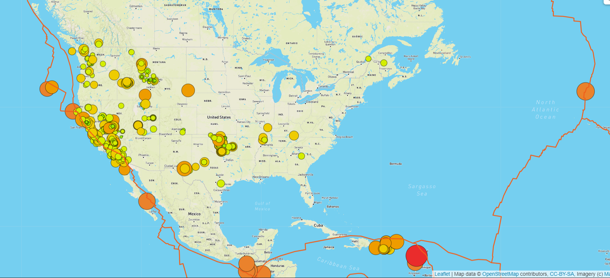
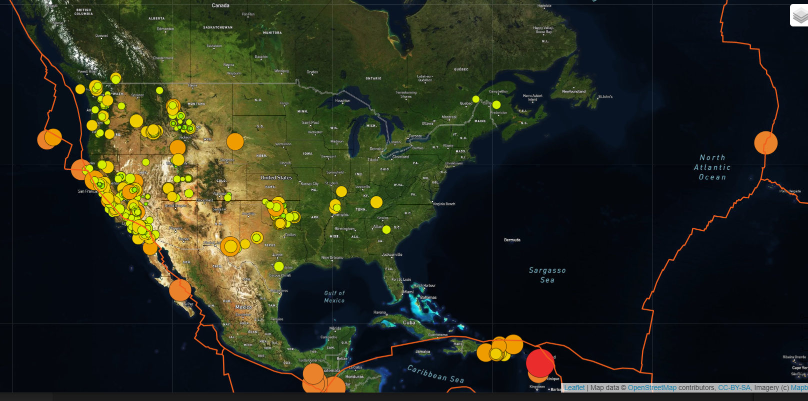
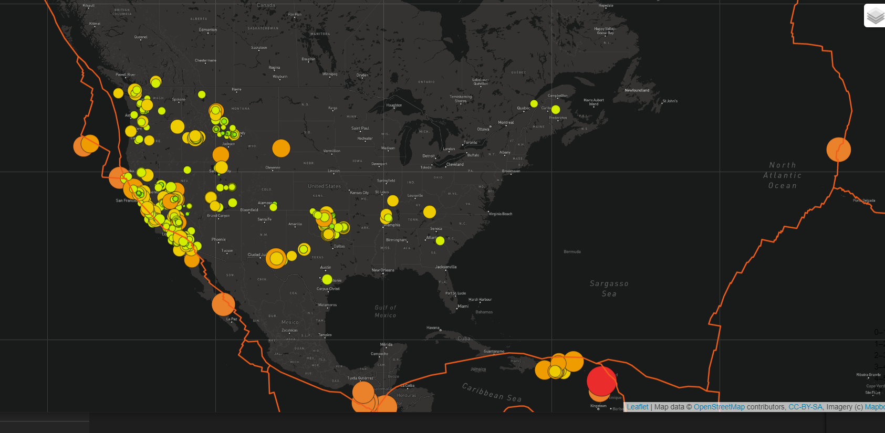

# Mapping Earthquakes with JS and APIs

## Purpose of the Project

- The purpose of this project is to see the earthquake data in relation to the tectonic plates’ location on the earth, and well as to see all the earthquakes with a magnitude greater than 4.5 on the map. A dark version of the map is also created. 

## Results

- Below are the three maps made from the Javascript. Street, satellite, and dark versions respectively. 
- 
- 
- 

